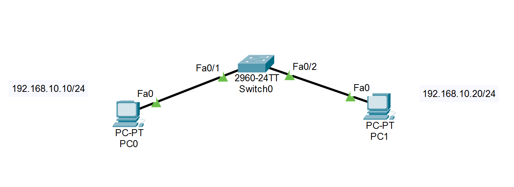

# Lab 01 - IPv4 Address Configuration

## Objective

Configure IPv4 addresses manually on two PCs connected to the same LAN and verify connectivity using the `ping` command.

## Topology

## Devices Used

- 2 PCs
- 1 Cisco 2960 Switch
- Copper Straight-Through Cables

## IP Addressing

| Device | IP Address | Subnet Mask |
|---------|------------|-------------|
| PC0 | 192.168.10.10 | 255.255.255.0 |
| PC1 | 192.168.10.20 | 255.255.255.0 |

## Configuration Steps

1. Connect both PCs to the switch.
2. Assign the IPv4 address and subnet mask to each PC.
3. Verify communication using the `ping` command.

## Verification

- Ping from **PC0** to **PC1**
- Ping from **PC1** to **PC0**
- Both pings should be successful.

## Skills Practiced

- IPv4 addressing
- Subnet mask configuration
- LAN communication
- Connectivity testing

## Files Included

- `Lab-01-IPv4-Address-Configuration.pkt`
- `topology.png`
- `README.md`

## Result

Both PCs successfully communicate after being configured with valid IPv4 addresses on the same network.