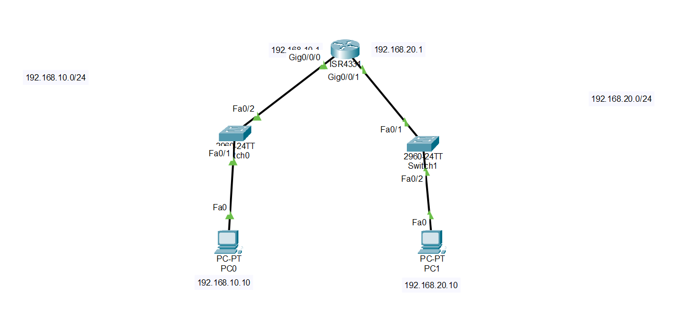

# Lab 02 - Subnetting and Network Communication

## Objective

Configure two different IPv4 networks connected by a router and verify communication between them.

## Topology



## Devices Used

- 1 Cisco Router
- 2 Cisco 2960 Switches
- 2 PCs
- Copper Straight-Through Cables

## IP Addressing

| Device | Interface | IP Address | Subnet Mask | Default Gateway |
|---------|-----------|------------|-------------|-----------------|
| PC0 | NIC | 192.168.10.10 | 255.255.255.0 | 192.168.10.1 |
| R1 | G0/0 | 192.168.10.1 | 255.255.255.0 | - |
| R1 | G0/1 | 192.168.20.1 | 255.255.255.0 | - |
| PC1 | NIC | 192.168.20.10 | 255.255.255.0 | 192.168.20.1 |

## Configuration

### Router Configuration

```bash
interface g0/0
ip address 192.168.10.1 255.255.255.0
no shutdown

interface g0/1
ip address 192.168.20.1 255.255.255.0
no shutdown
```

## Configuration Steps

1. Connect each PC to its switch.
2. Connect both switches to the router.
3. Configure the router interfaces.
4. Configure the IPv4 address and default gateway on each PC.
5. Verify connectivity using the `ping` command.

## Verification

- Ping from **PC0** to **PC1**
- Ping from **PC1** to **PC0**
- Verify successful communication between both networks.

## Skills Practiced

- IPv4 addressing
- Subnetting
- Router interface configuration
- Default gateway configuration
- Inter-network communication

## Files Included

- `Lab-02-Subnetting-and-Network-Communication.pkt`
- `topology.png`
- `README.md`

## Result

The router successfully routes traffic between the two IPv4 networks, allowing devices on different subnets to communicate.