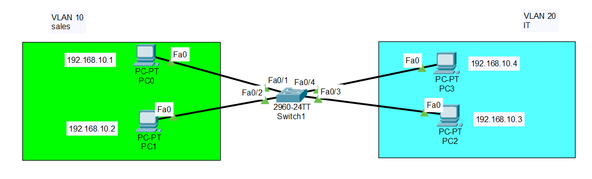

# Lab 01 - VLAN Basics

## Objective

Create VLANs on a Cisco switch, assign access ports to each VLAN, configure end devices, and verify communication within the same VLAN while isolating traffic between different VLANs.

## Topology



## Devices Used

- 1 Cisco 2960 Switch
- 4 PCs
- Copper Straight-Through Cables

## VLAN Configuration

| VLAN | Name | Devices |
|------|------|---------|
| 10 | Sales | PC0, PC1 |
| 20 | IT | PC2, PC3 |

## IP Addressing

| Device | VLAN | IP Address | Subnet Mask |
|---------|------|------------|-------------|
| PC0 | 10 | 192.168.10.10 | 255.255.255.0 |
| PC1 | 10 | 192.168.10.20 | 255.255.255.0 |
| PC2 | 20 | 192.168.10.30 | 255.255.255.0 |
| PC3 | 20 | 192.168.10.40 | 255.255.255.0 |

## Configuration

### Create VLANs

```bash
vlan 10
name Sales

vlan 20
name IT
```

### Assign Access Ports

```bash
interface range fa0/1 - 2
switchport mode access
switchport access vlan 10

interface range fa0/3 - 4
switchport mode access
switchport access vlan 20
```

## Verification

### Verify VLAN Configuration

```bash
show vlan brief
```

### Connectivity Tests

- ✅ PC0 can communicate with PC1.
- ✅ PC2 can communicate with PC3.
- ❌ PC0 cannot communicate with PC2.
- ❌ PC1 cannot communicate with PC3.

## Skills Practiced

- VLAN creation
- VLAN naming
- Access port configuration
- VLAN verification using `show vlan brief`
- Broadcast domain segmentation
- Basic Layer 2 network design

## Files Included

- `Lab-01-VLAN-Basics.pkt`
- `topology.png`
- `README.md`

## Result

Successfully configured VLANs on a Cisco switch, assigned switch ports to the appropriate VLANs, and verified that communication is limited to devices within the same VLAN while traffic between different VLANs remains isolated.