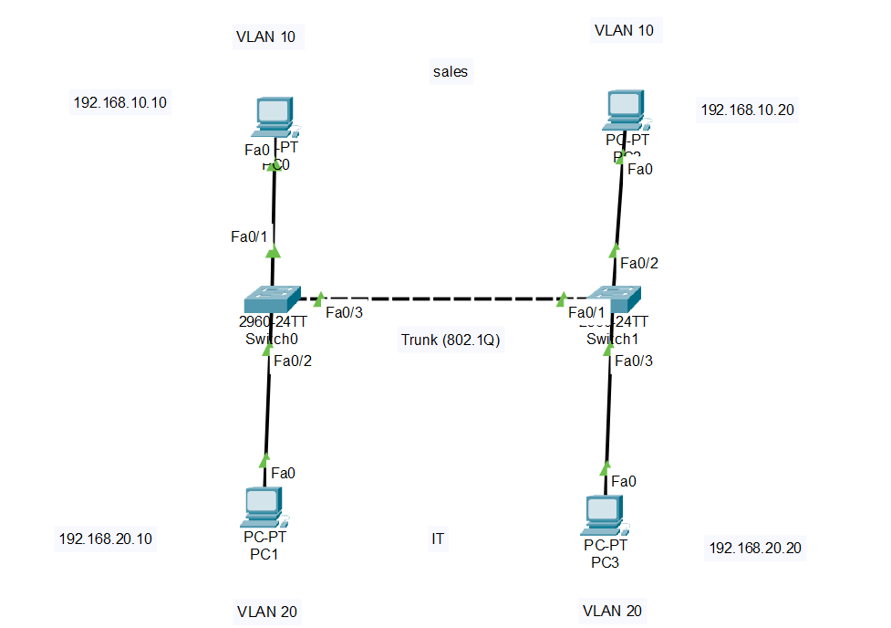

# Lab 02 - 802.1Q Trunking

## Objective

Configure an 802.1Q trunk between two Cisco switches and verify that multiple VLANs can communicate across the trunk while maintaining VLAN isolation.

## Topology



## Devices Used

- 2 Cisco 2960 Switches
- 4 PCs
- Copper Straight-Through Cables
- Copper Cross-Over Cable (or Auto-Connect) between switches

## VLAN Configuration

| VLAN | Name | Devices |
|------|------|---------|
| 10 | Sales | PC0, PC2 |
| 20 | IT | PC1, PC3 |

## IP Addressing

| Device | VLAN | IP Address |
|---------|------|------------|
| PC0 | 10 | 192.168.10.10 |
| PC2 | 10 | 192.168.10.20 |
| PC1 | 20 | 192.168.20.10 |
| PC3 | 20 | 192.168.20.20 |

## Configuration

### Create VLANs

```bash
vlan 10
name Sales

vlan 20
name IT
```

### Configure Access Ports

```bash
interface fa0/1
switchport mode access
switchport access vlan 10

interface fa0/2
switchport mode access
switchport access vlan 20
```

### Configure the Trunk

```bash
interface fa0/24
switchport mode trunk
```

## Verification

```bash
show interfaces trunk
```

```bash
show vlan brief
```

### Connectivity Tests

- ✅ PC0 ↔ PC2 (VLAN 10)
- ✅ PC1 ↔ PC3 (VLAN 20)
- ❌ Communication between VLAN 10 and VLAN 20 is not possible without inter-VLAN routing.

## Skills Practiced

- 802.1Q Trunking
- VLAN Extension Across Multiple Switches
- Access Port Configuration
- Trunk Verification
- Layer 2 Segmentation

## Files Included

- `Lab-02-802.1Q-Trunking.pkt`
- `topology.png`
- `README.md`

## Result

Successfully configured an 802.1Q trunk between two switches, allowing VLAN traffic to traverse the trunk while maintaining separation between different VLANs.