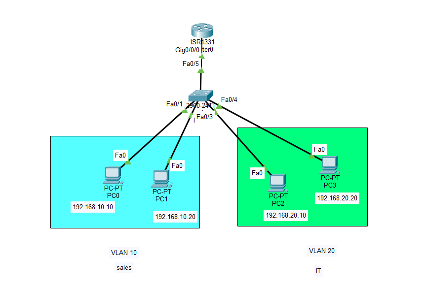

# Lab 03 - Inter-VLAN Routing (Router-on-a-Stick)

## Objective

Configure Router-on-a-Stick to enable communication between multiple VLANs using 802.1Q trunking and router subinterfaces.

## Topology



## Devices Used

- 1 Cisco Router
- 1 Cisco 2960 Switch
- 4 PCs
- Copper Straight-Through Cables

## VLAN Configuration

| VLAN | Name | Devices |
|------|------|---------|
| 10 | Sales | PC0, PC1 |
| 20 | IT | PC2, PC3 |

## IP Addressing

| Device | VLAN | IP Address | Default Gateway |
|---------|------|------------|-----------------|
| PC0 | 10 | 192.168.10.10 | 192.168.10.1 |
| PC1 | 10 | 192.168.10.20 | 192.168.10.1 |
| PC2 | 20 | 192.168.20.10 | 192.168.20.1 |
| PC3 | 20 | 192.168.20.20 | 192.168.20.1 |

## Configuration

### Switch

- Created VLAN 10 and VLAN 20.
- Assigned access ports to the appropriate VLANs.
- Configured the router-facing interface as an 802.1Q trunk.

### Router

Configured two subinterfaces:

- GigabitEthernet0/0.10
- GigabitEthernet0/0.20

Each subinterface was assigned the appropriate VLAN encapsulation and gateway IP address.

## Verification

```bash
show ip interface brief
show ip route
show interfaces trunk
```

- Successful communication between devices in different VLANs.
- Verified router subinterfaces and trunk configuration.

## Skills Practiced

- Router-on-a-Stick
- 802.1Q Trunking
- Router Subinterfaces
- Inter-VLAN Routing
- Default Gateway Configuration
- Layer 3 Switching Concepts

## Files Included

- `Lab-03-Inter-VLAN-Routing.pkt`
- `topology.png`
- `README.md`

## Result

Successfully enabled communication between VLAN 10 and VLAN 20 using Router-on-a-Stick with 802.1Q encapsulation.