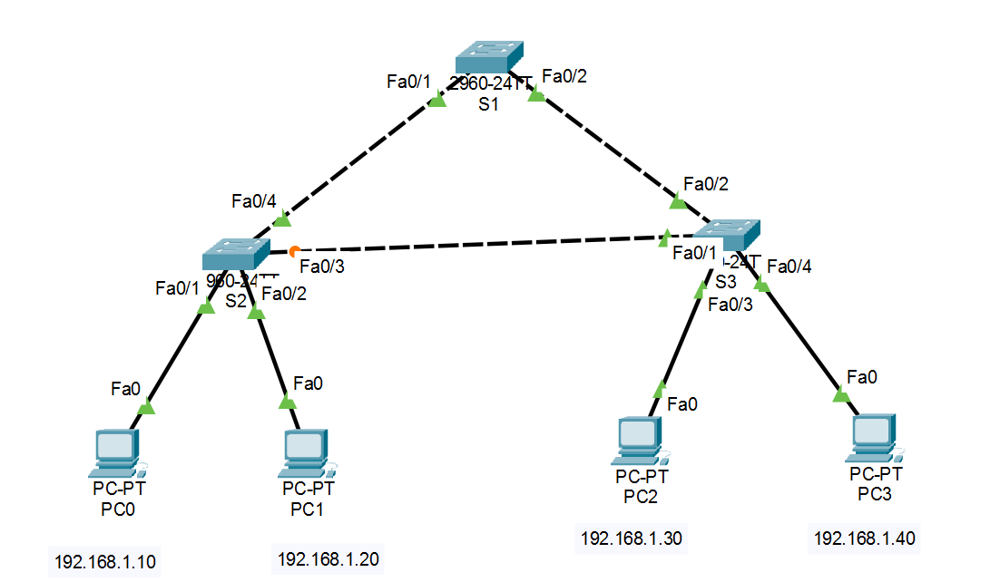

# Lab 01 - STP Root Bridge

## Objective

Observe the Spanning Tree Protocol (STP) election process and identify the Root Bridge, Root Ports, Designated Ports, and Blocking Port in a redundant Layer 2 topology.

## Topology



## Devices Used

- 3 Cisco 2960 Switches

## Scenario

Three switches are connected in a triangle, creating redundant paths that could cause a Layer 2 loop. STP automatically selects a Root Bridge and blocks one redundant path to maintain a loop-free topology.

## Verification

```bash
show spanning-tree
show spanning-tree vlan 1
```

## Skills Practiced

- Root Bridge election
- Root Port identification
- Designated Port identification
- Blocking Port identification
- STP verification

## Files Included

- `Lab-01-STP-Root-Bridge.pkt`
- `topology.png`
- `README.md`

## Result

STP successfully elected a Root Bridge and blocked one redundant path, preventing switching loops.