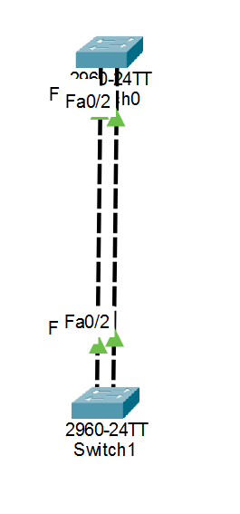

# Lab 06 - EtherChannel (LACP)

## Objective

Configure an EtherChannel using LACP to bundle multiple physical links into a single logical trunk between two Cisco switches.

## Topology



## Devices Used

- 2 Cisco 2960 Switches
- Copper Cross-Over Cables (or Auto-Connect)

## Configuration

### Configure EtherChannel

```bash
interface range fa0/1 - 2
channel-group 1 mode active
```

### Configure the Port-Channel

```bash
interface port-channel 1
switchport mode trunk
```

## Verification

```bash
show etherchannel summary
```

```bash
show interfaces trunk
```

## Skills Practiced

- EtherChannel
- LACP (IEEE 802.3ad)
- Port-Channel Configuration
- Trunk Configuration
- Link Aggregation
- Switch Verification

## Files Included

- `Lab-06-EtherChannel-LACP.pkt`
- `topology.png`
- `README.md`

## Result

Successfully configured an LACP EtherChannel between two switches, combining multiple physical interfaces into a single logical trunk to improve bandwidth and provide link redundancy.