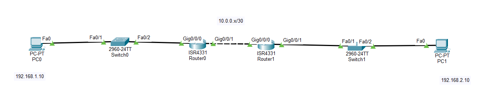

# Lab 01 - Static Routing

## Objective

Configure static routes between two routers to enable communication between devices on different networks.

## Topology



## Devices Used

- 2 Cisco Routers
- 2 Cisco 2960 Switches
- 2 PCs
- Copper Straight-Through Cables

## IP Addressing

| Device | Interface | IP Address | Subnet Mask | Default Gateway |
|---------|-----------|------------|-------------|-----------------|
| PC0 | NIC | 192.168.1.10 | 255.255.255.0 | 192.168.1.1 |
| R1 | G0/0 | 192.168.1.1 | 255.255.255.0 | - |
| R1 | G0/1 | 10.0.0.1 | 255.255.255.252 | - |
| R2 | G0/0 | 10.0.0.2 | 255.255.255.252 | - |
| R2 | G0/1 | 192.168.2.1 | 255.255.255.0 | - |
| PC1 | NIC | 192.168.2.10 | 255.255.255.0 | 192.168.2.1 |

## Configuration

### R1

```bash
interface g0/0
ip address 192.168.1.1 255.255.255.0
no shutdown

interface g0/1
ip address 10.0.0.1 255.255.255.252
no shutdown

ip route 192.168.2.0 255.255.255.0 10.0.0.2
```

### R2

```bash
interface g0/0
ip address 10.0.0.2 255.255.255.252
no shutdown

interface g0/1
ip address 192.168.2.1 255.255.255.0
no shutdown

ip route 192.168.1.0 255.255.255.0 10.0.0.1
```

## Verification

### Verify the Routing Table

```bash
show ip route
```

### Test Connectivity

- Ping from **PC0** to **PC1**
- Ping from **PC1** to **PC0**

Both pings should be successful.

## Skills Practiced

- Static Routing
- Router Interface Configuration
- IPv4 Addressing
- Routing Table Verification
- End-to-End Connectivity Testing

## Files Included

- `Lab-01-Static-Routing.pkt`
- `topology.png`
- `README.md`

## Result

Successfully configured static routes on both routers, allowing communication between two different networks through manual route configuration.