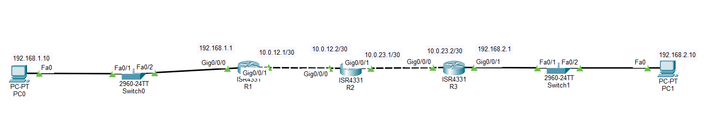

# Lab 02 - Default Route

## Objective

Configure default static routes on edge routers to forward all unknown traffic to a central router, demonstrating the concept of the **Gateway of Last Resort**.

## Topology



## Devices Used

- 3 Cisco Routers
- 2 Cisco 2960 Switches
- 2 PCs
- Copper Straight-Through Cables

## IP Addressing

| Device | Interface | IP Address | Subnet Mask | Default Gateway |
|---------|-----------|------------|-------------|-----------------|
| PC0 | NIC | 192.168.1.10 | 255.255.255.0 | 192.168.1.1 |
| R1 | G0/0 | 192.168.1.1 | 255.255.255.0 | - |
| R1 | G0/1 | 10.0.12.1 | 255.255.255.252 | - |
| R2 | G0/0 | 10.0.12.2 | 255.255.255.252 | - |
| R2 | G0/1 | 10.0.23.1 | 255.255.255.252 | - |
| R3 | G0/0 | 10.0.23.2 | 255.255.255.252 | - |
| R3 | G0/1 | 192.168.2.1 | 255.255.255.0 | - |
| PC1 | NIC | 192.168.2.10 | 255.255.255.0 | 192.168.2.1 |

## Configuration

### R1

```bash
interface g0/0
ip address 192.168.1.1 255.255.255.0
no shutdown

interface g0/1
ip address 10.0.12.1 255.255.255.252
no shutdown

ip route 0.0.0.0 0.0.0.0 10.0.12.2
```

### R2

```bash
interface g0/0
ip address 10.0.12.2 255.255.255.252
no shutdown

interface g0/1
ip address 10.0.23.1 255.255.255.252
no shutdown

ip route 192.168.1.0 255.255.255.0 10.0.12.1
ip route 192.168.2.0 255.255.255.0 10.0.23.2
```

### R3

```bash
interface g0/0
ip address 10.0.23.2 255.255.255.252
no shutdown

interface g0/1
ip address 192.168.2.1 255.255.255.0
no shutdown

ip route 0.0.0.0 0.0.0.0 10.0.23.1
```

## Configuration Steps

1. Configure all router interfaces.
2. Configure IP addresses and default gateways on both PCs.
3. Configure a default route on R1 pointing to R2.
4. Configure static routes on R2 to both LANs.
5. Configure a default route on R3 pointing to R2.
6. Verify connectivity between both networks.

## Verification

### Verify Routing Tables

```bash
show ip route
```

Verify that R1 and R3 display:

```text
S* 0.0.0.0/0
```

### Test Connectivity

- Ping from **PC0** to **PC1**
- Ping from **PC1** to **PC0**

Both pings should be successful.

## Skills Practiced

- Default Static Route Configuration
- Gateway of Last Resort
- Router Interface Configuration
- Static Routing
- Routing Table Verification
- End-to-End Connectivity Testing

## Files Included

- `Lab-02-Default-Route.pkt`
- `topology.png`
- `README.md`

## Result

Successfully configured default static routes on the edge routers, allowing unknown traffic to be forwarded to the central router while maintaining connectivity between both LANs.