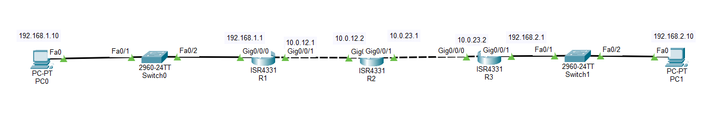

# Lab 03 - RIP Version 2

## Objective

Configure RIP Version 2 (RIPv2) on multiple routers to dynamically exchange routing information and enable communication between different networks without using static routes.

## Topology



## Devices Used

- 3 Cisco ISR4331 Routers
- 2 Cisco 2960 Switches
- 2 PCs
- Copper Straight-Through Cables

## Network Topology

```
PC0 ── S1 ── R1 ── R2 ── R3 ── S2 ── PC1
```

## IP Addressing

| Device | Interface | IP Address | Subnet Mask |
|---------|-----------|------------|-------------|
| PC0 | NIC | 192.168.1.10 | 255.255.255.0 |
| R1 | G0/0/0 | 192.168.1.1 | 255.255.255.0 |
| R1 | G0/0/1 | 10.0.12.1 | 255.255.255.252 |
| R2 | G0/0/0 | 10.0.12.2 | 255.255.255.252 |
| R2 | G0/0/1 | 10.0.23.1 | 255.255.255.252 |
| R3 | G0/0/0 | 10.0.23.2 | 255.255.255.252 |
| R3 | G0/0/1 | 192.168.2.1 | 255.255.255.0 |
| PC1 | NIC | 192.168.2.10 | 255.255.255.0 |

## Configuration

### R1

```bash
router rip
version 2
no auto-summary

network 192.168.1.0
network 10.0.12.0
```

### R2

```bash
router rip
version 2
no auto-summary

network 10.0.12.0
network 10.0.23.0
```

### R3

```bash
router rip
version 2
no auto-summary

network 10.0.23.0
network 192.168.2.0
```

## Verification

Verify the routing table:

```bash
show ip route
```

The routing table should display routes learned through RIP marked with the **R** code.

Verify RIP operation:

```bash
show ip protocols
```

Test end-to-end connectivity:

- Ping from **PC0** to **PC1**
- Ping from **PC1** to **PC0**

Both pings should be successful.

## Skills Practiced

- RIP Version 2 Configuration
- Dynamic Routing
- Route Advertisement
- Router-to-Router Communication
- Routing Table Verification
- End-to-End Network Connectivity

## Files Included

- `Lab-03-RIP.pkt`
- `topology.png`
- `README.md`

## Result

Successfully configured RIP Version 2 on three routers to dynamically exchange routing information. Verified that all routers learned remote networks automatically and confirmed end-to-end connectivity between both LANs without using static routes.