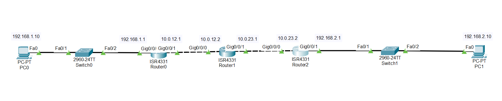

# Lab 04 - OSPF (Single Area)

## Objective

Configure OSPF (Open Shortest Path First) in a single-area network (Area 0) to dynamically exchange routing information between routers and provide end-to-end connectivity.

## Topology



## Devices Used

- 3 Cisco ISR4331 Routers
- 2 Cisco 2960 Switches
- 2 PCs
- Copper Straight-Through Cables

## Network Topology

```
PC0 ── S1 ── R1 ── R2 ── R3 ── S2 ── PC1
```

## IP Addressing

| Device | Interface | IP Address | Subnet Mask |
|---------|-----------|------------|-------------|
| PC0 | NIC | 192.168.1.10 | 255.255.255.0 |
| R1 | G0/0/0 | 192.168.1.1 | 255.255.255.0 |
| R1 | G0/0/1 | 10.0.12.1 | 255.255.255.252 |
| R2 | G0/0/0 | 10.0.12.2 | 255.255.255.252 |
| R2 | G0/0/1 | 10.0.23.1 | 255.255.255.252 |
| R3 | G0/0/0 | 10.0.23.2 | 255.255.255.252 |
| R3 | G0/0/1 | 192.168.2.1 | 255.255.255.0 |
| PC1 | NIC | 192.168.2.10 | 255.255.255.0 |

## Configuration

### R1

```bash
router ospf 1
network 192.168.1.0 0.0.0.255 area 0
network 10.0.12.0 0.0.0.3 area 0
```

### R2

```bash
router ospf 1
network 10.0.12.0 0.0.0.3 area 0
network 10.0.23.0 0.0.0.3 area 0
```

### R3

```bash
router ospf 1
network 10.0.23.0 0.0.0.3 area 0
network 192.168.2.0 0.0.0.255 area 0
```

## Verification

Verify OSPF neighbors:

```bash
show ip ospf neighbor
```

Verify the routing table:

```bash
show ip route
```

Routes learned through OSPF are marked with the **O** code.

Test end-to-end connectivity:

- Ping from **PC0** to **PC1**
- Ping from **PC1** to **PC0**

## Skills Practiced

- OSPF Single Area Configuration
- OSPF Neighbor Formation
- Dynamic Routing
- Wildcard Masks
- Routing Table Verification
- End-to-End Connectivity Testing

## Files Included

- `Lab-04-OSPF-Single-Area.pkt`
- `topology.png`
- `README.md`

## Result

Successfully configured OSPF Area 0 on three routers, established OSPF neighbor relationships, dynamically exchanged routing information, and verified full connectivity between both LANs.