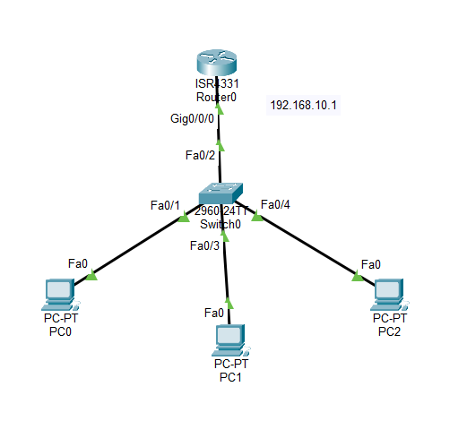

# Lab 01 - DHCP Configuration

## Objective

Configure a Cisco router as a DHCP server to automatically assign IP addresses, subnet masks, default gateways, and DNS server information to client devices.

## Topology



## Devices Used

- 1 Cisco ISR4331 Router
- 1 Cisco 2960 Switch
- 3 PCs
- Copper Straight-Through Cables


## Network Information

| Device | Interface | IP Address | Subnet Mask |
|---------|-----------|------------|-------------|
| R1 | G0/0 | 192.168.10.1 | 255.255.255.0 |
| PCs | DHCP | Assigned Automatically | 255.255.255.0 |

### DHCP Pool

| Setting | Value |
|---------|-------|
| Pool Name | OFFICE |
| Network | 192.168.10.0/24 |
| Default Gateway | 192.168.10.1 |
| DNS Server | 8.8.8.8 |
| Excluded Addresses | 192.168.10.1 – 192.168.10.10 |

## Configuration

### Configure Router Interface

```bash
interface g0/0
ip address 192.168.10.1 255.255.255.0
no shutdown
```

### Exclude Reserved Addresses

```bash
ip dhcp excluded-address 192.168.10.1 192.168.10.10
```

### Configure DHCP Pool

```bash
ip dhcp pool OFFICE

network 192.168.10.0 255.255.255.0

default-router 192.168.10.1

dns-server 8.8.8.8
```

### Configure Clients

On each PC:

```
Desktop → IP Configuration → DHCP
```

## Verification

Verify DHCP bindings:

```bash
show ip dhcp binding
```

Verify DHCP pool information:

```bash
show ip dhcp pool
```

Verify interface status:

```bash
show ip interface brief
```

## Connectivity Tests

- Verify each PC receives an IP address automatically.
- Ping the default gateway (192.168.10.1).
- Ping between PCs.

## Skills Practiced

- DHCP Server Configuration
- DHCP Address Pool Configuration
- Excluding IP Addresses
- Automatic IP Address Assignment
- DHCP Verification
- End-to-End Connectivity Testing

## Files Included

- `Lab-01-DHCP.pkt`
- `topology.png`
- `README.md`

## Result

Successfully configured a Cisco router as a DHCP server. Client devices automatically obtained IP addresses, subnet masks, default gateway, and DNS server information, demonstrating centralized IP address management.