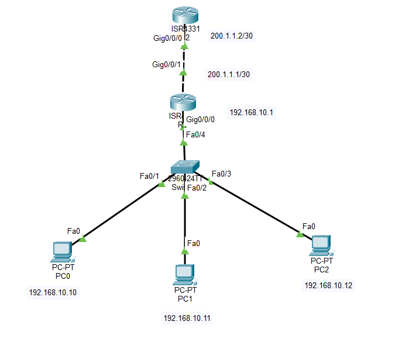

# Lab 02 - NAT Overload (PAT)

## Objective

Configure Network Address Translation (NAT) Overload, also known as Port Address Translation (PAT), to allow multiple devices on a private network to share a single public IP address when accessing an external network.

## Topology



## Devices Used

- 2 Cisco ISR4331 Routers
- 1 Cisco 2960 Switch
- 3 PCs
- Copper Straight-Through Cables


## IP Addressing

| Device | Interface | IP Address | Subnet Mask |
|---------|-----------|------------|-------------|
| PC0 | NIC | 192.168.10.10 | 255.255.255.0 |
| PC1 | NIC | 192.168.10.11 | 255.255.255.0 |
| PC2 | NIC | 192.168.10.12 | 255.255.255.0 |
| R1 | G0/0 | 192.168.10.1 | 255.255.255.0 |
| R1 | G0/1 | 200.1.1.1 | 255.255.255.252 |
| R2 | G0/0 | 200.1.1.2 | 255.255.255.252 |

## Configuration

### Configure Default Route

```bash
ip route 0.0.0.0 0.0.0.0 200.1.1.2
```

### Configure Access List

```bash
access-list 1 permit 192.168.10.0 0.0.0.255
```

### Configure NAT

```bash
interface g0/0
ip nat inside

interface g0/1
ip nat outside

ip nat inside source list 1 interface g0/1 overload
```

## Verification

Verify NAT translations:

```bash
show ip nat translations
```

Verify NAT statistics:

```bash
show ip nat statistics
```

Generate traffic by pinging from a PC to the external router.

## Skills Practiced

- NAT Overload (PAT)
- Access Control Lists (ACLs)
- Inside and Outside Interface Configuration
- Default Route Configuration
- NAT Translation Verification

## Files Included

- `Lab-02-NAT-Overload.pkt`
- `topology.png`
- `README.md`

## Result

Successfully configured NAT Overload (PAT) to translate private IP addresses into a single public IP address, allowing multiple internal devices to access an external network through one public interface.