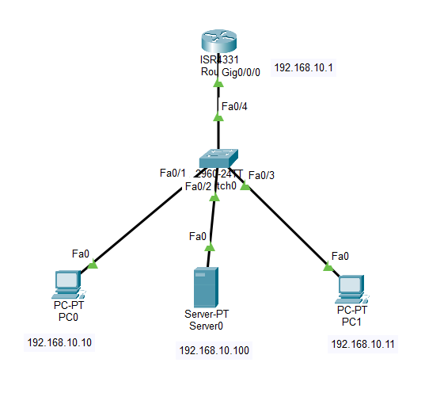

# Lab 03 - DNS and Web Server

## Objective

Configure a DNS server and an HTTP Web Server in Cisco Packet Tracer, allowing client devices to access a website using a domain name instead of an IP address.

## Topology



## Devices Used

- 1 Cisco ISR4331 Router
- 1 Cisco 2960 Switch
- 1 Server
- 2 PCs
- Copper Straight-Through Cables


## IP Addressing

| Device | Interface | IP Address | Subnet Mask |
|---------|-----------|------------|-------------|
| R1 | G0/0 | 192.168.10.1 | 255.255.255.0 |
| Server | FastEthernet | 192.168.10.100 | 255.255.255.0 |
| PC0 | NIC | 192.168.10.10 | 255.255.255.0 |
| PC1 | NIC | 192.168.10.11 | 255.255.255.0 |

### Default Gateway

```
192.168.10.1
```

### DNS Server

```
192.168.10.100
```

## Configuration

### Router Configuration

```bash
interface g0/0
ip address 192.168.10.1 255.255.255.0
no shutdown
```

### Server Configuration

Configure the server with:

- IP Address: `192.168.10.100`
- Subnet Mask: `255.255.255.0`
- Default Gateway: `192.168.10.1`
- DNS Server: `192.168.10.100`

### DNS Configuration

Enable the DNS service and create the following record:

| Domain Name | IP Address |
|-------------|------------|
| www.company.com | 192.168.10.100 |

### HTTP Configuration

Enable the HTTP service on the server.

(Optional) Customize the default web page with your own message.

### PC Configuration

Configure each PC with:

- IP Address
- Subnet Mask
- Default Gateway
- DNS Server (`192.168.10.100`)

or obtain the configuration automatically using DHCP.

## Verification

Verify DNS resolution:

```text
ping www.company.com
```

Verify connectivity:

```text
ping 192.168.10.100
```

Open the Web Browser on a PC and navigate to:

```text
http://www.company.com
```

The webpage should load successfully.

## Skills Practiced

- DNS Server Configuration
- HTTP Web Server Configuration
- Static IP Addressing
- Domain Name Resolution
- Client-to-Server Communication
- Network Service Verification

## Files Included

- `Lab-03-DNS-and-Web-Server.pkt`
- `topology.png`
- `README.md`

## Result

Successfully configured a DNS server and an HTTP Web Server in Cisco Packet Tracer. Client devices were able to resolve the domain name to the server's IP address and access the hosted website through a web browser.