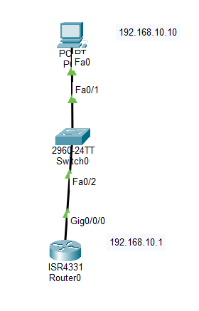

# Lab 04 - SSH Remote Management

## Objective

Configure Secure Shell (SSH) on a Cisco router to allow secure remote management from a client PC.



> Add a screenshot of your Packet Tracer topology here.

## Devices Used

- 1 Cisco ISR4331 Router
- 1 Cisco 2960 Switch
- 1 PC
- Copper Straight-Through Cables

## IP Addressing

| Device | Interface | IP Address | Subnet Mask |
|---------|-----------|------------|-------------|
| PC0 | NIC | 192.168.10.10 | 255.255.255.0 |
| R1 | G0/0 | 192.168.10.1 | 255.255.255.0 |

Default Gateway: **192.168.10.1**

## Configuration

### Configure Router Interface

```bash
interface g0/0
ip address 192.168.10.1 255.255.255.0
no shutdown
```

### Configure SSH

```bash
hostname R1

ip domain-name company.local

username admin privilege 15 secret Cisco123

crypto key generate rsa

ip ssh version 2

line vty 0 4
login local
transport input ssh
```

## Verification

Verify SSH status:

```bash
show ip ssh
```

Verify active sessions:

```bash
show users
```

From the PC, connect to the router:

```bash
ssh -l admin 192.168.10.1
```

## Skills Practiced

- SSH Configuration
- RSA Key Generation
- Local User Authentication
- VTY Line Configuration
- Secure Remote Management
- SSH Verification

## Files Included

- `Lab-04-SSH-Remote-Management.pkt`
- `topology.png`
- `README.md`

## Result

Successfully configured SSH on a Cisco router, enabling secure remote management using encrypted communication and local user authentication.