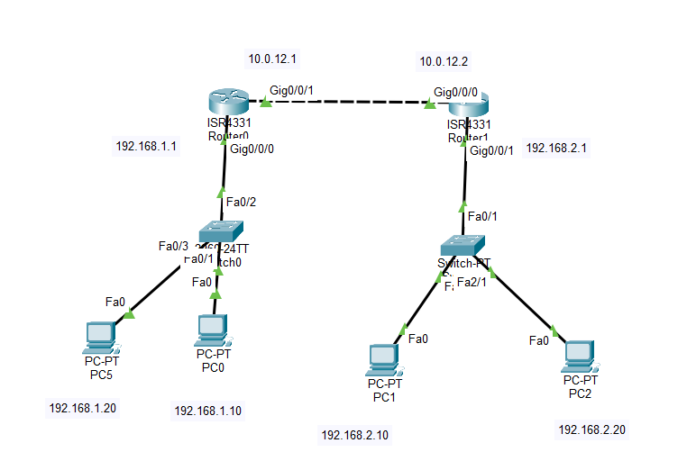

# Lab 01 - Standard ACL

## Objective

Configure a Standard Access Control List (ACL) to block traffic from a specific source IP address while allowing all other traffic to pass.

## Topology



## Devices Used

- 2 Cisco ISR4331 Routers
- 2 Cisco 2960 Switches
- 4 PCs
- Copper Straight-Through Cables


## IP Addressing

| Device | Interface | IP Address | Subnet Mask |
|---------|-----------|------------|-------------|
| PC0 | NIC | 192.168.1.10 | 255.255.255.0 |
| PC3 | NIC | 192.168.1.20 | 255.255.255.0 |
| R1 | G0/0/0 | 192.168.1.1 | 255.255.255.0 |
| R1 | G0/0/1 | 10.0.12.1 | 255.255.255.252 |
| R2 | G0/0/0 | 10.0.12.2 | 255.255.255.252 |
| R2 | G0/0/1 | 192.168.2.1 | 255.255.255.0 |
| PC1 | NIC | 192.168.2.10 | 255.255.255.0 |
| PC2 | NIC | 192.168.2.20 | 255.255.255.0 |

## Configuration

### Configure Static Routing

#### R1

```bash
ip route 192.168.2.0 255.255.255.0 10.0.12.2
```

#### R2

```bash
ip route 192.168.1.0 255.255.255.0 10.0.12.1
```

### Configure the Standard ACL

On **R2**:

```bash
access-list 1 deny host 192.168.1.10
access-list 1 permit any
```

### Apply the ACL

```bash
interface g0/0/1
ip access-group 1 out
```

## Verification

Verify the routing table:

```bash
show ip route
```

Verify the ACL:

```bash
show access-lists
```

Test connectivity:

- Ping from **PC0** to **PC1** (Should Fail)
- Ping from **PC0** to **PC2** (Should Fail)


## Skills Practiced

- Standard ACL Configuration
- Source IP Filtering
- ACL Placement
- Static Routing
- ACL Verification
- Connectivity Testing

## Files Included

- `Lab-01-Standard-ACL.pkt`
- `topology.png`
- `README.md`

## Result

Successfully configured a Standard ACL to block traffic from a specific source IP address while allowing all other traffic to pass. Verified ACL operation using access-list counters and end-to-end connectivity tests.