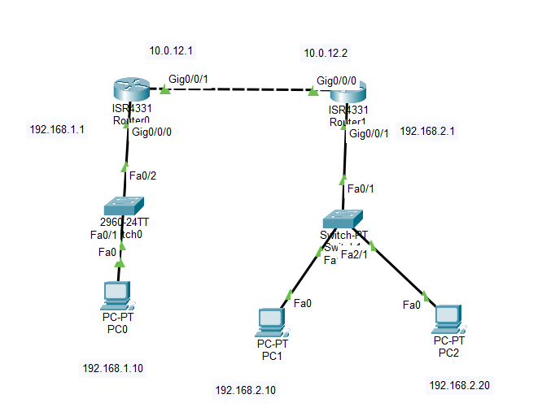

# Lab 02 - Extended ACL

## Objective

Configure an Extended Access Control List (ACL) to block ICMP (ping) traffic from a specific source to a specific destination while allowing all other traffic.

## Topology



## Devices Used

- 2 Cisco ISR4331 Routers
- 2 Cisco 2960 Switches
- 3 PCs
- Copper Straight-Through Cables

## Network Topology

```
                     10.0.12.0/30

        G0/0/1                     G0/0/0
   10.0.12.1 ------------------- 10.0.12.2
             R1                 R2
              |                  |
              |                  |
         G0/0/0              G0/0/1
      192.168.1.1         192.168.2.1
              |                  |
             S1                 S2
              |                /  \
            PC0             PC1   PC2

       192.168.1.10     192.168.2.10
                         192.168.2.20
```

## IP Addressing

| Device | Interface | IP Address | Subnet Mask |
|---------|-----------|------------|-------------|
| PC0 | NIC | 192.168.1.10 | 255.255.255.0 |
| R1 | G0/0/0 | 192.168.1.1 | 255.255.255.0 |
| R1 | G0/0/1 | 10.0.12.1 | 255.255.255.252 |
| R2 | G0/0/0 | 10.0.12.2 | 255.255.255.252 |
| R2 | G0/0/1 | 192.168.2.1 | 255.255.255.0 |
| PC1 | NIC | 192.168.2.10 | 255.255.255.0 |
| PC2 | NIC | 192.168.2.20 | 255.255.255.0 |

## Configuration

### Configure Static Routing

#### R1

```bash
ip route 192.168.2.0 255.255.255.0 10.0.12.2
```

#### R2

```bash
ip route 192.168.1.0 255.255.255.0 10.0.12.1
```

### Configure the Extended ACL

On **R1**:

```bash
access-list 100 deny icmp host 192.168.1.10 host 192.168.2.10
access-list 100 permit ip any any
```

### Apply the ACL

```bash
interface g0/0/0
ip access-group 100 in
```

## Verification

Verify the routing table:

```bash
show ip route
```

Verify the ACL:

```bash
show access-lists
```

Test connectivity:

- Ping from **PC0** to **PC1** (Should Fail)
- Ping from **PC0** to **PC2** (Should Succeed)
- Ping from **PC1** to **PC0** (Should Succeed)

## Skills Practiced

- Extended ACL Configuration
- ICMP Traffic Filtering
- Source and Destination IP Matching
- ACL Placement Best Practices
- Static Routing
- ACL Verification
- Connectivity Testing

## Files Included

- `Lab-02-Extended-ACL.pkt`
- `topology.png`
- `README.md`

## Result

Successfully configured an Extended ACL to block ICMP traffic from a specific source host to a specific destination host while allowing all other traffic. Verified the ACL using connectivity tests and access-list hit counters.