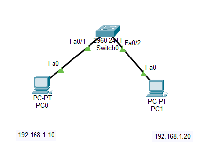

# Lab 03 - Port Security

## Objective

Configure Port Security on a Cisco switch to allow only one authorized device to connect to a switch port using Sticky MAC Address learning.

## Topology



## Devices Used

- 1 Cisco 2960 Switch
- 2 PCs
- Copper Straight-Through Cables


## IP Addressing

| Device | Interface | IP Address | Subnet Mask |
|---------|-----------|------------|-------------|
| PC0 | NIC | 192.168.1.10 | 255.255.255.0 |
| PC1 | NIC | 192.168.1.20 | 255.255.255.0 |
| S1 | VLAN 1 (Optional) | 192.168.1.1 | 255.255.255.0 |

## Configuration

Configure the access port:

```bash
interface fa0/1
switchport mode access
```

Enable Port Security:

```bash
switchport port-security
switchport port-security maximum 1
switchport port-security mac-address sticky
switchport port-security violation shutdown
```

## Verification

Verify Port Security status:

```bash
show port-security
```

Verify interface details:

```bash
show port-security interface fa0/1
```

Verify learned MAC addresses:

```bash
show port-security address
```

Verify interface status:

```bash
show interfaces status
```

## Skills Practiced

- Port Security Configuration
- Sticky MAC Address Learning
- Secure Access Port Configuration
- Violation Modes
- Interface Recovery
- Switch Security Verification

## Files Included

- `Lab-03-Port-Security.pkt`
- `topology.png`
- `README.md`

## Result

Successfully configured Port Security using Sticky MAC Address learning to allow only one authorized device on the switch port. Verified that unauthorized devices triggered a security violation and placed the interface into the err-disabled state.