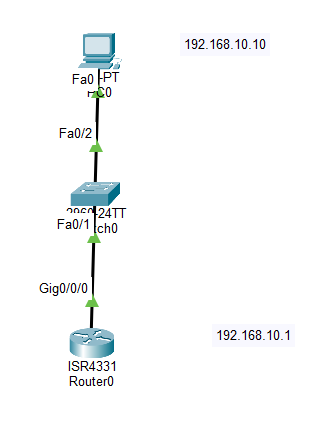

# Lab 04 - Secure Device Access

## Objective

Configure basic security features on a Cisco router to protect administrative access, including encrypted passwords, console and VTY authentication, password encryption, and a login banner.

## Topology



## Devices Used

- 1 Cisco ISR4331 Router
- 1 Cisco 2960 Switch
- 1 PC
- Copper Straight-Through Cables


## IP Addressing

| Device | Interface | IP Address | Subnet Mask |
|---------|-----------|------------|-------------|
| PC0 | NIC | 192.168.10.10 | 255.255.255.0 |
| R1 | G0/0 | 192.168.10.1 | 255.255.255.0 |

## Configuration

### Basic Device Security

```bash
hostname R1

enable secret class

service password-encryption
```

### Console Access

```bash
line console 0
password cisco
login
```

### VTY Access

```bash
line vty 0 4
password cisco
login
transport input telnet ssh
```

### MOTD Banner

```bash
banner motd #
Unauthorized access is prohibited!
#
```

## Verification

Verify the configuration:

```bash
show running-config
```

Verify password encryption:

```bash
show running-config | include password
```

Reconnect to the router and confirm that the MOTD banner and password authentication are working.

## Skills Practiced

- Device Hardening
- Enable Secret Configuration
- Console Security
- VTY Security
- Password Encryption
- MOTD Banner Configuration
- Configuration Verification

## Files Included

- `Lab-04-Secure-Device-Access.pkt`
- `topology.png`
- `README.md`

## Result

Successfully secured a Cisco router by configuring encrypted administrative passwords, console and VTY authentication, password encryption, and a login banner, improving the overall security of device management.