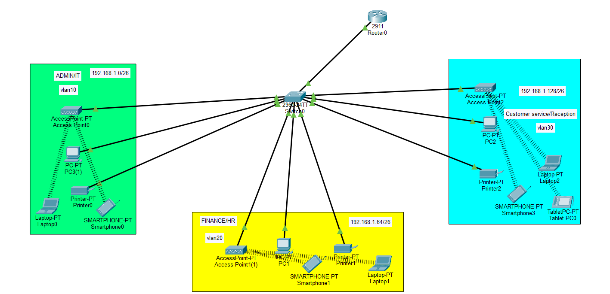

# Small Company Network

## Overview

This project is a Cisco Packet Tracer simulation of a small company network designed to demonstrate the implementation of core CCNA networking concepts in a realistic business environment.

The network provides secure communication between departments while implementing essential routing, switching, and network services.

---

## Objectives

- Design a reliable network for a small company.
- Segment the network using VLANs.
- Enable communication between different departments.
- Provide automatic IP address assignment.
- Implement secure remote device management.
- Verify connectivity and network functionality.

---

## Network Topology

---

## Devices Used

- Cisco Routers
- Cisco Catalyst Switches
- PCs , laptops , tablets and smartphones

---

## Verification

The following tests were performed successfully:

- PC-to-PC connectivity
- Inter-VLAN communication
- DHCP address assignment

---

## Skills Demonstrated

- Network Design
- IP Address Planning
- Router Configuration
- Switch Configuration
- VLAN Implementation
- Trunk Configuration
- Inter-VLAN Routing
- DHCP Configuration
- Network Troubleshooting

---

## Files Included

- `Small-Company-Network.pkt`
- `README.md`
- `topology.png`

---

## Learning Outcomes

This project strengthened my practical understanding of designing, configuring, and troubleshooting a small business network using Cisco Packet Tracer. It combines multiple CCNA topics into a single network topology, providing hands-on experience with routing, switching and network services.

---

## Author

**Yassin Tarek**

Engineering Student | Computer Engineering

Learning Networking, Backend Development, and Building Hands-on Projects.